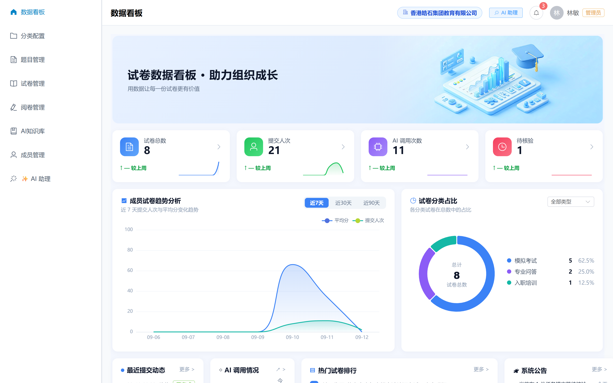
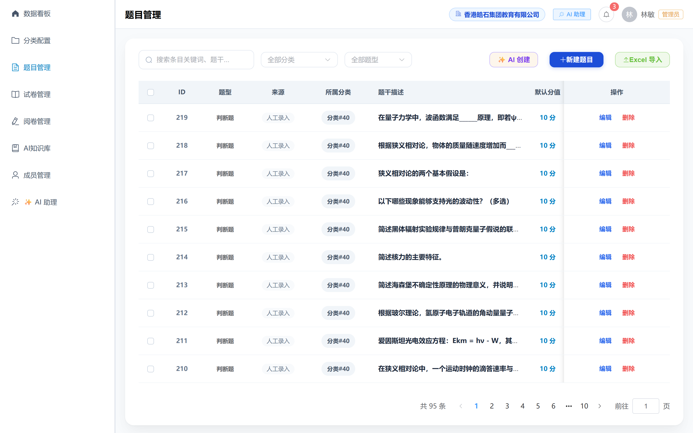
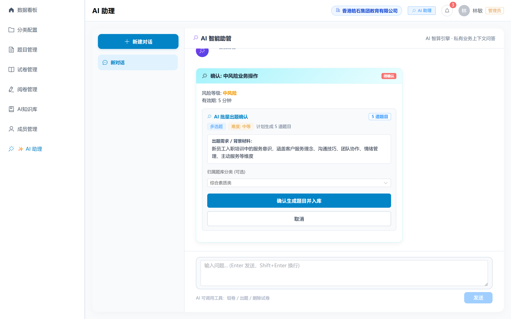
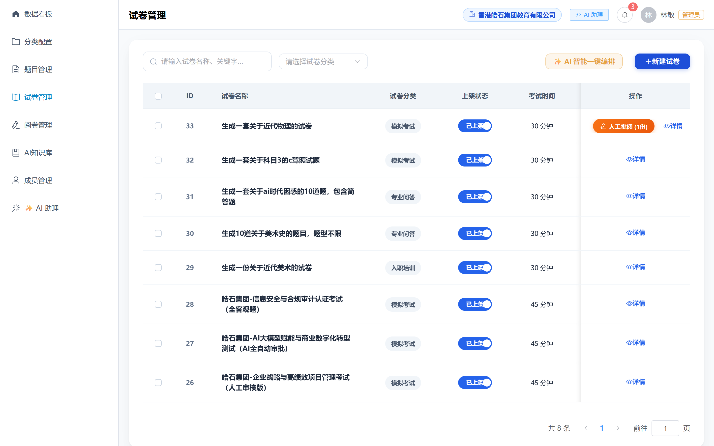
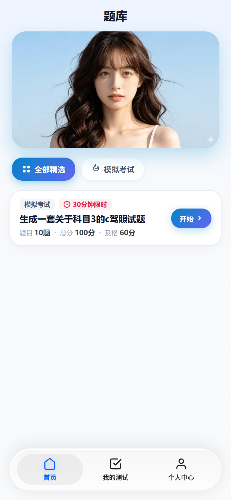
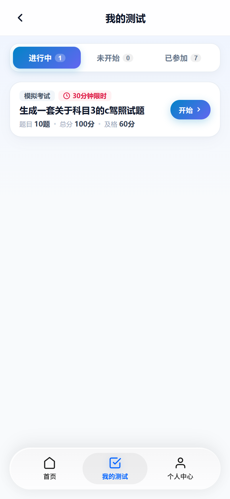
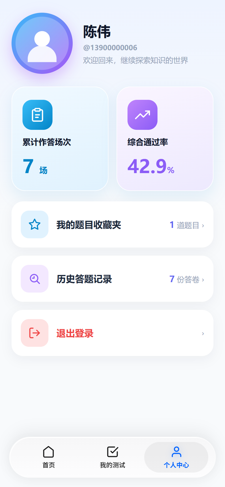

# TiKu — Enterprise Multi-Tenant Smart Quiz & Online Assessment System

A modern, lightweight AI-Native assessment and examination platform: **B-end SaaS Management Console** (Question Assets, Intelligent Exam Assembly, Grading Center, AI Question-Generation Assistant, Multi-tenant Isolation) + **C-end Mobile Examinee App** (Quiz, Timed Exams, Answer Sheet Drawer, Anti-leakage Reports, Favorites) + **FastAPI Core Backend**.

- **GitHub**: [https://github.com/JasonOracle/tiku](https://github.com/JasonOracle/tiku)
- **Gitee**: [https://gitee.com/jason-oracle/tiku](https://gitee.com/jason-oracle/tiku)
- **Chinese Documentation**: [README.md](./README.md)
- **v1.4 Feature Showcase & Snapshots**: [docs/v1.4_showcase.md](./docs/v1.4_showcase.md)

---

## 📈 Milestones & Progressive Evolution

This project strictly adheres to an **agile, progressive development** lifecycle, ensuring every iteration delivers verifiable software artifacts and frozen snapshots:

```
┌─────────────────┐       ┌─────────────────┐       ┌─────────────────┐       ┌─────────────────┐
│     v1.0 MVP    │  ──>  │  v1.2 AI-Native │  ──>  │ v1.4 SaaS & Agent│ ──>  │   v1.5 Geek App │
│ Objective Tests │       │Fill/Essay + AI  │       │ Multi-Tenant+LLM│       │ Uni-app Mobile  │
└─────────────────┘       └─────────────────┘       └─────────────────┘       └─────────────────┘
  Archived (v1.0)           Archived (v1.2)           Archived (v1.4-final)       In Progress...
```

- **v1.0 (MVP Closed Loop)**: Completed basic single/multiple choice and true/false questions, exam assembly, PC/H5 test-taking, and automated scoring.
- **v1.2 (AI-Native Upgrade)**: Added fill-in-the-blank and essay questions; integrated SenseNova LLM for automated essay pre-grading; introduced instructor isolation and audit logs.
- **v1.4 (SaaS Multi-Tenancy & Agent Interaction Revolution - Current Stable)**:
  - **Strict Multi-Tenant Isolation**: Complete logical and data isolation between educational institutions (e.g., Xingya Education) and enterprise compliance training (e.g., Haoshi Group);
  - **Deep AI Agent Integration**: Conversational batch question generation, dynamic drafting cards, anti-leakage guards, and full history persistence (`action_card_data`);
  - **Automated Snapshot Engineering**: Built-in Playwright automated headless screenshot and Markdown generation engine (`scripts/snapshot_showcase.py`).
- **v1.5 (Cross-Platform Geek Remodel - Currently Underway)**:
  - Complete overhaul of C-end mobile client using `uni-app` (Vue 3.5 + TS + Vite) + `Wot Design Uni`;
  - Immersive "Geek Blue" design, pure SVG icon system, single-question focus flow, and secure review-mode dynamic reports.

---

## 📸 System Snapshots (v1.4 Showcase)

> For the comprehensive snapshot guide, see 👉 **[v1.4 Showcase & System Architecture](./docs/v1.4_showcase.md)**

### B-End SaaS Admin Console (Desktop PC)

| Dashboard | Question Bank Assets |
| :---: | :---: |
|  |  |

| AI Assistant & Drafting Cards | Exam Assembly & Management |
| :---: | :---: |
|  |  |

### C-End Examinee Mobile Client (iPhone Viewport)

| Enterprise Workspace | Assessment List | Personal Profile & Stats |
| :---: | :---: | :---: |
|  |  |  |

---

## 🏗️ Project Structure

```
tiku/
├── backend/                  # FastAPI core (SaaS multi-tenancy, JWT, AI engine)
├── tob/                      # B-end admin console (Vue 3.5 + Element Plus + Pinia)
├── toc/                      # C-end H5 client (Vue 3.5)
├── toc-new/                  # [v1.5 in progress] C-end uni-app + Wot Design Uni project
├── docs/                     # System snapshots and illustrated showcases
│   ├── v1.4_showcase.md      # v1.4 full walkthrough report
│   └── images/v1.4/          # 12 high-resolution real-world screenshots
├── history/                  # Historical specification archives (v1.3 / v1.4)
├── scripts/                  # Automation & headless screenshot engine
│   ├── snapshot_showcase.py  # Playwright automated capture script
│   └── ...
├── nginx.conf                # Unified reverse proxy
└── docker-compose.yml        # Docker container orchestration
```

---

## 🚀 Quick Start

### Docker Compose (Recommended)

```bash
# Start MySQL 8.0, FastAPI backend, and Nginx reverse proxy
docker compose up -d

# Reload Nginx after static build updates
docker exec tiku_nginx nginx -s reload
```

| Portal | URL | Demo Account / Password | Role |
| :--- | :--- | :--- | :--- |
| **B-End Admin** | `http://localhost/admin` | `13800000012` / `123456` | Enterprise Admin (Haoshi Group) |
| **B-End Super Admin**| `http://localhost/admin` | `13800000000` / `123456` | Platform Super Admin |
| **C-End Examinee** | `http://localhost` | `13900000006` / `123456` | Employee / Student (Member) |
| **Swagger API** | `http://localhost/docs` | — | Interactive OpenAPI Docs |

---

## 🤖 AI-Driven Development Paradigm

This repository is also a comprehensive case study in **human-AI collaborative software engineering**:

1. **Constitutional Agent Governance**: Core guidelines laid out in [`agent.md`](./agent.md) enforce tenant isolation, change logging, and anti-context-loss workflows.
2. **Snapshot-Driven Version Handoff**: Strict protocols govern version increments (`v1.4-final` tag, physical archiving of PRD/Tech specs to `history/`), ensuring zero drift across sprints.
3. **Self-Documenting Architecture**: Integrated headless browser automations continuously capture and regenerate live visual proof of feature maturity.

---

## 📚 Core Documentation Index

- **[`agent.md`](./agent.md)** — **Highest Priority!** Must be read before any agent interaction.
- **[`progress.md`](./progress.md)** — Current source of truth, roadmap, and handover checklist.
- **[`product.md`](./product.md)** — Latest Product Requirements Document (PRD).
- **[`tech-spec.md`](./tech-spec.md)** — System architecture and technical specifications.
- **[`api-contract.md`](./api-contract.md)** — Backend API contracts and security rules.
- **[`history/`](./history/)** — Historical version specifications.
