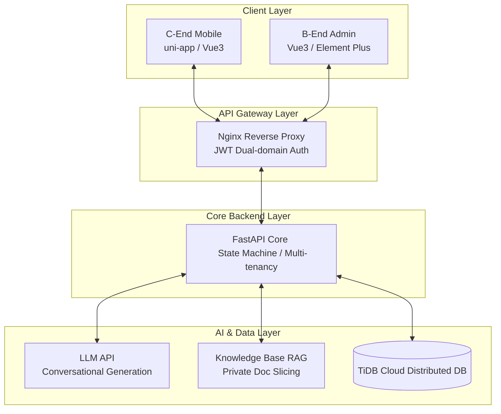

# TiKu — Enterprise Multi-Tenant Smart Quiz & Online Assessment System

A modern, lightweight AI-Native assessment and examination platform. This project is not just a full-stack open-source product, but a deep engineering practice showcasing how a **frontend engineer can leverage AI to independently deliver a complete enterprise SaaS system**.

The system includes: **B-End SaaS Management Console** (Multi-tenant isolation, Intelligent Exam Assembly, AI Question-Generation Assistant) + **C-End Examinee Mobile App** (uni-app cross-platform, Anti-leakage Reports, Smart Grading) + **FastAPI Core Backend**.

- **GitHub Repository**: [https://github.com/JasonOracle/tiku](https://github.com/JasonOracle/tiku)
- **Gitee Mirror**: [https://gitee.com/jason-oracle/tiku](https://gitee.com/jason-oracle/tiku)
- **Chinese Documentation**: [README.md](./README.md)
- 🎨 **v1.5 C-End Showcase Guide**: [docs/v1.5_c_showcase.md](./docs/v1.5_c_showcase.md)
- 🖥️ **v1.4 B-End Showcase Guide**: [docs/v1.4_showcase.md](./docs/v1.4_showcase.md)
- 📖 **Zero-Cost Cloud Deployment Guide**: [docs/deploy-free-cloud.md](./docs/deploy-free-cloud.md)

---

## 🌐 Public Live Demo

Both the C-End and B-End of this system are fully deployed to the cloud (Cloudflare Pages + Vercel Serverless + TiDB Cloud). **No local setup required, click to experience**:

| Service / App | Public URL Entry | Demo Credentials | Description |
| :--- | :--- | :--- | :--- |
| **📱 C-End Mobile (Examinee)** | [https://tiku-toc-new.pages.dev](https://tiku-toc-new.pages.dev/#/) | `13900000001` / `123456` | Cloudflare hosted, native uni-app cross-platform |
| **💻 B-End Admin Console** | [https://tiku-tob.pages.dev/dashboard](https://tiku-tob.pages.dev/dashboard) | `13800000012` / `123456` | Haoshi Group Enterprise Admin (SaaS tenant) |
| **⚡ FastAPI Cloud API** | [https://tiku-api.vercel.app/docs](https://tiku-api.vercel.app/docs) | — | Vercel hosted, OpenAPI / Swagger interactive schema |

---

## 💡 Engineering Highlights & Architecture



This project focuses on solving three major engineering pain points in online assessment systems:

### 1. 🤖 AI-Native Engineering & Control Boundaries
As the core architect of this project, I clearly defined the boundaries of AI capabilities. Instead of blindly pursuing low-level algorithm fine-tuning, I focused on **"Engineering the integration of AI with frontend workflows"**:
- **Conversational Smart Question & Exam Generation**: Breaking away from traditional form inputs, I designed an LLM-based conversational UI. Through strict structural Prompt contracts, it automatically generates single/multiple choice, fill-in-the-blank, and even entire exams based on job roles or specific knowledge points, drastically reducing manual effort.
- **AI Action Cards (Risk Control)**: To keep LLM outputs within strict, controllable business boundaries, I conceptualized the interactive "Action Card" mechanism. The AI does *not* write directly to the database. Instead, it renders a "mimic drafting card" containing the question details. Administrators must manually approve (adopt/discard) this card, ensuring deterministic, system-level risk control.
- **AI Long-Term Memory & State Persistence**: For complex exam generation scenarios requiring multi-turn context, I bridged the AI session state with the B-end workflow. By persisting conversation history and action card data (`action_card_data`) deeply into TiDB, the smart assistant gains long-term memory and coherent context, allowing the AI to trace back previous modification intents at any time.

### 2. 🚀 Frontend Cross-Platform Rebuild & SaaS Multi-Tenancy
- **C-End Native De-abstraction**: In v1.5, I abandoned heavy, multi-layered black-box abstractions and performed a cross-platform native rebuild using `uni-app` (Vue 3.5 + Vite). All question types utilize a straightforward, flattened rendering strategy, completely eliminating white screen glitches and layout miscalculations on mobile devices.
- **SaaS Logical Isolation**: With the combination of Vue3/Pinia and FastAPI, a true multi-tenant environment was realized. Whether for corporate compliance (e.g., Haoshi Group) or educational training (e.g., Xingya Education), perfect physical and logical data isolation is achieved on a single platform instance.
- **Apple Light-Titanium Design Language**: The system fully adopts a highly transparent `#fbfbfd` titanium background with dual-temperature subtle diffuse micro-glow, balancing a geeky feel with premium aesthetics.

### 3. 🛡️ Strict Security & Anti-Cheating Defenses
- **DOM-Level Physical Anti-Leakage**: To combat "packet sniffing" and "inspect element" cheating, I implemented a dual-end interception mechanism. When an exam is in an unverified state (`pending_verification`), the server completely strips answer nodes and blocks the delivery of explanations. On the frontend, these elements do not exist in the DOM at a physical level.
- **Robust Clock Synchronization & State Machine Locks**:
  - Exam countdowns are strictly anchored to the server's start timestamp, rendering client-side local clock manipulation useless.
  - Exams follow a strict one-way state machine: `draft → published → archived`. Once an exam is published and locked, all database modification actions are frozen, eliminating any possibility of "tampering with questions mid-exam".

---

## 📸 System Snapshots (Showcase)

### I. v1.5 C-End Examinee Mobile Client (Apple Light-Titanium)
> For the comprehensive visual specification guide, see 👉 **[v1.5 C-End Showcase & Visual Spec Guide](./docs/v1.5_c_showcase.md)**

| Twilight Login | Assessment Lobby (Home) | Immersive Exam Room |
| :---: | :---: | :---: |
|  |  |  |

| Assessment Progress (Records) | Score Review Report | Profile & Favorites |
| :---: | :---: | :---: |
|  |  |  |

---

### II. v1.4 B-End SaaS Admin Console (Desktop PC)
> For the comprehensive snapshot guide, see 👉 **[v1.4 Showcase & System Architecture](./docs/v1.4_showcase.md)**

| Dashboard | Question Bank Assets |
| :---: | :---: |
|  |  |

| AI Assistant & Drafting Cards | Exam Assembly & Management |
| :---: | :---: |
|  |  |

---

## 🏗️ Project Structure

```
tiku/
├── backend/                  # FastAPI core (State machine, Multi-tenancy, AI Gateway)
├── tob/                      # B-end admin console (Vue 3.5 + Element Plus + Pinia)
├── toc-new/                  # [v1.5 Latest] C-end cross-platform native app (uni-app)
├── docs/                     # Public showcase & deployment guides
├── history/                  # Historical specification archives
├── scripts/                  # Automated testing & Playwright snapshot engine
├── nginx.conf                # Unified reverse proxy
└── docker-compose.yml        # Docker container orchestration
```

---

## 🚀 Quick Start

### Docker Compose (Recommended for Local Full-Stack)
```bash
# Start MySQL 8.0, FastAPI backend, and Nginx reverse proxy
docker compose up -d

# Reload Nginx after static build updates
docker exec tiku_nginx nginx -s reload
```

### Local Split-Environment Development
```bash
# 1. Start Backend (FastAPI)
cd backend && python -m venv venv
venv\Scripts\activate
pip install -r requirements.txt
uvicorn app.main:app --reload --port 8000

# 2. Start B-End Admin (Vue 3 + Vite)
cd ../tob && pnpm install && pnpm dev

# 3. Start C-End Examinee App (uni-app + Vite)
cd ../toc-new && pnpm install && pnpm dev:h5
```

---

## 📝 Developer's Note

As an engineer with a frontend development background, navigating the current challenging industry cycle, this project represents my deep dive into **AI-Driven Development**.

Throughout the entire R&D lifecycle, I not only independently managed the frontend cross-platform rebuild from H5 to uni-app, overcoming mobile rendering performance bottlenecks and complex multi-tenant state management (via Pinia), but I also served as the project's **"Architect and Orchestrator"**. I clearly delineated the engineering boundaries between business requirements and AI capabilities. By leveraging Large Language Models to bridge the language barriers of backend and database technologies, I successfully built the full-stack closed loop of the FastAPI core service and the TiDB distributed foundation from 0 to 1.

This project reinforces my belief that a modern developer's core competitive moat is no longer confined to the syntax details of a single language. Instead, it is the **ability to holistically control complex systems, maintain a clear sense of business boundaries, and execute the translation of AI capabilities into tangible engineering productivity**. This has always been my development philosophy, driving my relentless hunger and continuous learning for new technologies.

---

## 📈 Milestones & Progressive Evolution

This project strictly adheres to an **agile, progressive development** lifecycle, ensuring every iteration delivers verifiable software artifacts and frozen snapshots:

```
┌───────────┐   ┌───────────┐   ┌───────────┐   ┌───────────┐   ┌───────────┐   ┌───────────┐
│  v1.0 MVP │──>│ v1.1 Data │──>│v1.2 AI Grd│──>│v1.3 KB RAG│──>│v1.4 SaaS  │──>│v1.5 Titani│
│Objective  │   │Lock & Safe│   │Fill/Essay │   │Source-text│   │Multi-tenan│   │Uni-app OS │
└───────────┘   └───────────┘   └───────────┘   └───────────┘   └───────────┘   └───────────┘
  Archived(v1.0)  Archived(v1.1)  Archived(v1.2)  Archived(v1.3)  Archived(v1.4)  Delivered(1.5)
```

- **v1.0 (MVP Closed Loop)**: Completed objective questions, exam assembly, and instant scoring.
- **v1.1 (Data Governance & Exam Lock)**: Introduced "published locking" and deletion reference checks.
- **v1.2 (AI-Native Upgrade)**: Integrated LLM for essay pre-grading and tenant audit logs.
- **v1.3 (KB RAG & State Machine)**: Integrated RAG for source highlighting; formalized the `draft → published → archived` state machine.
- **v1.4 (SaaS Multi-Tenancy & Agent)**: Realized true multi-tenant logic isolation and conversational drafting cards.
- **v1.5 (Cross-Platform Remodel)**: Apple Light-Titanium design language; rebuilt with `uni-app` to eliminate DOM abstractions; implemented physical anti-leakage defenses.

---

## 📚 Specifications Directory
- **[`agent.md`](./agent.md)** — **Highest Priority!** Establishes the core engineering code of conduct.
- **[`progress.md`](./progress.md)** — Project source of truth, roadmap, and operational guidelines.
- **[`product.md`](./product.md)** — Current Product Requirements Document (PRD).
- **[`tech-spec.md`](./tech-spec.md)** — Technical specification and architecture whitepaper.
- **[`api-contract.md`](./api-contract.md)** — Dual-end API contract and data privacy specifications.
