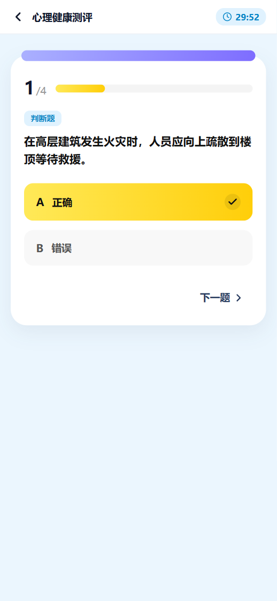
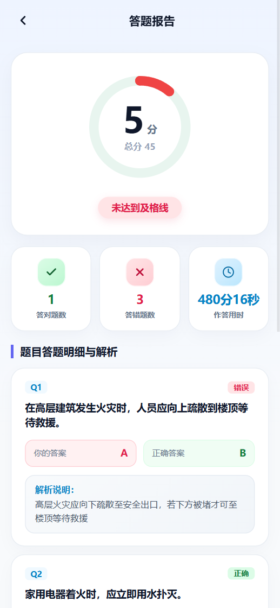
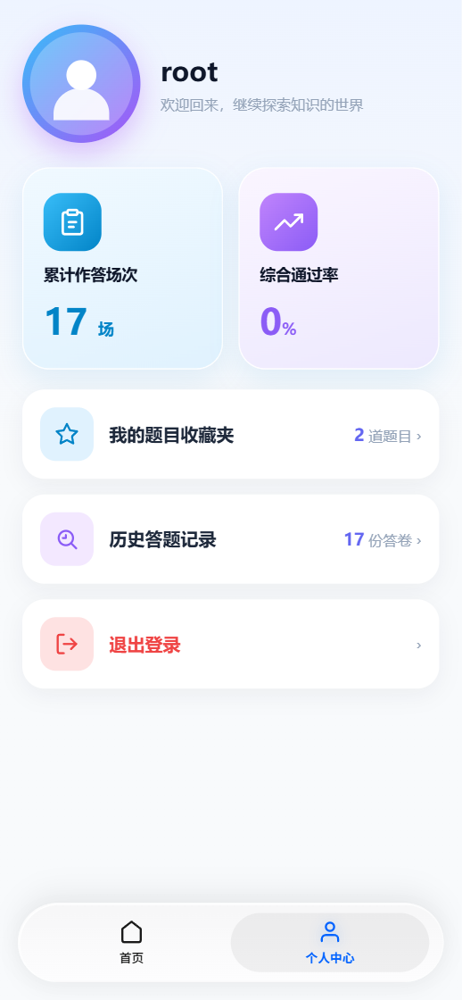
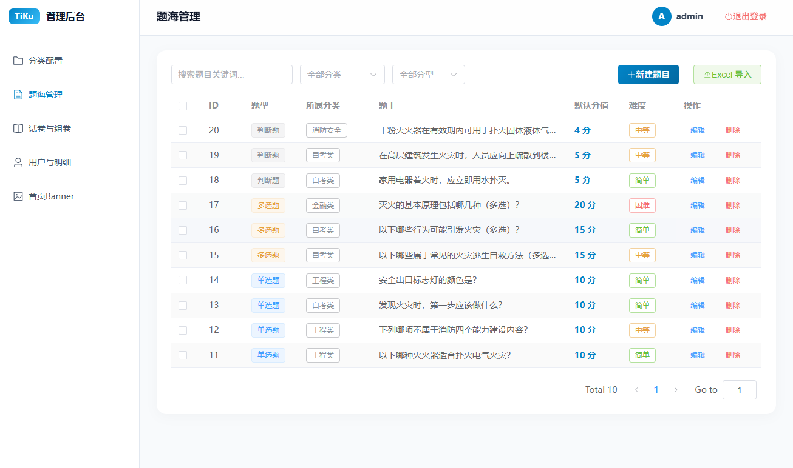
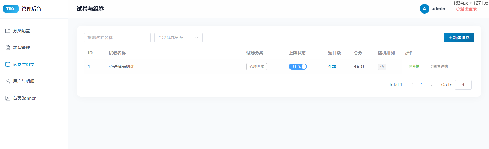

# 智题库 TiKu

轻量在线测评平台：C 端移动 H5（刷题/考试/分析报告/收藏）+ B 端 SaaS 管理后台（题库/组卷/上下架/考情看板）+ FastAPI 后端。

- 后端：`backend/` — Python 3.12 + FastAPI + SQLAlchemy 2.0 + MySQL 8.0，JWT（7 天，交卷 5 分钟宽限），悲观锁防重复交卷，被动超时结算
- B 端：`tob/` — Vue3 + Element Plus + Pinia，构建 `base: /admin/`
- C 端：`toc/` — Vue3 H5，构建挂 `/`
- 部署：`D:/docker/docker-compose.yml`（MySQL + backend + Nginx），Nginx 配置 `nginx.conf`，`/api/v1/` 反代 backend
- 导入模板：`sample_questions.xlsx`（数据表第一顺位 + “导入说明”工作表）

英文版：[README.en.md](./README.en.md)

## 项目展示

| C端 - 首页 & 答题页 | C端 - 解析页 & 个人中心 | B端 - 题海管理 & 组卷页面 |
| :---: | :---: | :---: |
|  <br/>  |  <br/>  |  <br/>  |

<details>
<summary>点击查看更多页面截图</summary>

- [C端 - 历史答题页](./assets/img/历史答题页截图v1.0.png)
- [C端 - 题目收藏页](./assets/img/题目收藏页截图v1.0.png)

</details>

## 目录

```
tiku/
├── backend/        # FastAPI（app/api/v1 C端，app/api/admin B端，tests/ 18项pytest）
├── tob/            # B端管理后台（Port 5173）
├── toc/            # C端H5（Port 5174）
├── nginx.conf      # /api/v1/→backend，/admin/→tob，/→toc
├── sample_questions.xlsx
├── product.md tech-spec.md api-contract.md progress.md
```

## 一键启动（Docker）

```powershell
cd D:\docker
docker compose up -d          # mysql 3306，backend 8000，nginx 80
docker exec tiku_nginx nginx -s reload   # backend重建后必执行
```

| 入口 | 地址 |
| :--- | :--- |
| C 端 | http://localhost/ |
| B 端 | http://localhost/admin/login（发版后 **Ctrl+Shift+R 硬刷**） |
| API/Swagger | http://localhost/api/v1/、http://localhost/docs |

测试账号：B 端 `admreg / AdmReg123`；C 端自行注册。MySQL：`root/rootpassword@127.0.0.1:3306/tiku_db`。

## 本地开发

```powershell
# 后端
cd backend; python -m uvicorn app.main:app --host 127.0.0.1 --port 8000
# B端 / C端（/api 经 vite proxy 转 8000，不断代理链）
cd tob; pnpm dev --port 5173
cd toc; pnpm dev --port 5174
```

前后端 `baseURL` 均为相对路径（生产走 Nginx 同源，禁止写死 `127.0.0.1:8000`）。

## 验证

```powershell
cd backend; python -m pytest tests/ -v        # 18 passed
cd ..\tob; pnpm build
cd ..\toc; pnpm build
```

## 核心治理规则（详见 progress.md §7）

- 试卷三态 `draft → published → archived`，**归档为彻底终态**（不可编辑/删除/重上架）；上架需有效分类并写 `category_name` 快照
- 删除守卫：分类/题目被引用拦；试卷仅 draft 零作答可删（有作答只能下架）
- 空卷不交卷：零作答提交 400，C 端离开/超时不提交
- 导入：Excel“分类”列逐题归入（不存在自动新建），`short/fill` 预留跳过计数；新建默认第一个分类

## 文档

- `progress.md` — 进度/踩坑/§8 接手清单（新模型先读）
- `api-contract.md` — 接口契约（含 400 守卫）
- `tech-spec.md` — 技术方案（§2.5 治理版）
- `product.md` — PRD
