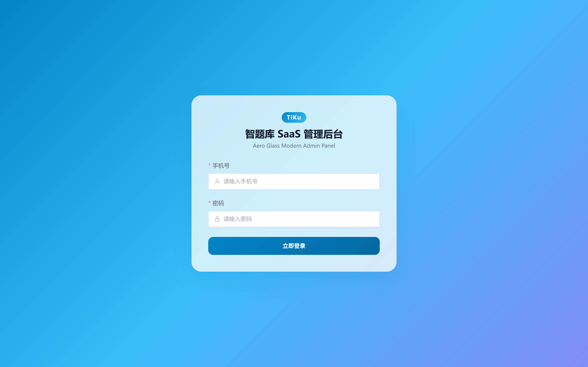
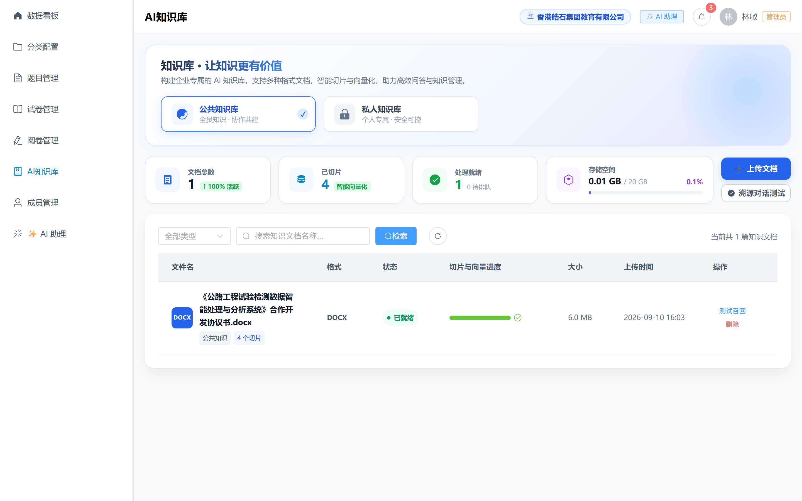
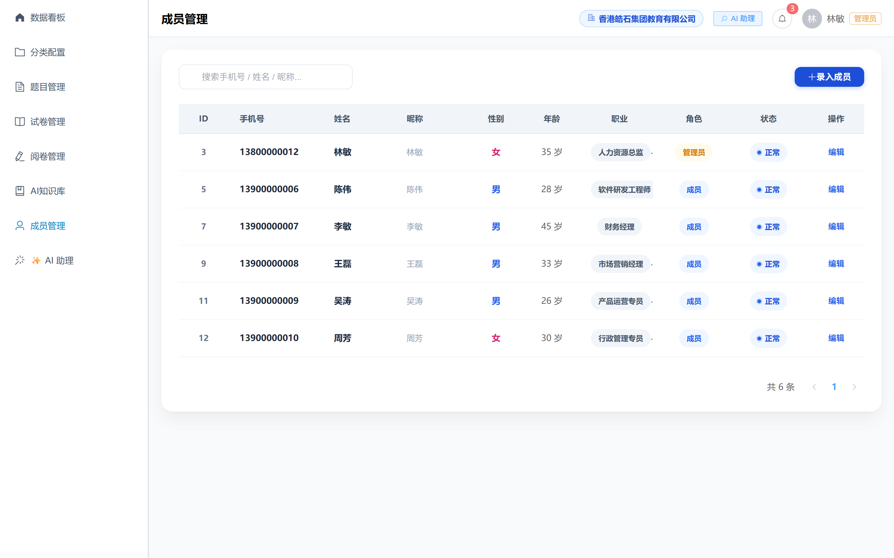
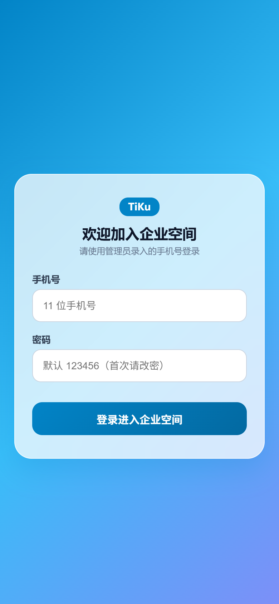

# 智题库 (TiKu) v1.4 系统功能快照与产品架构指南

> **版本定位**：企业级多租户智能题库与在线考核闭环系统  
> **核心特性**：多租户数据隔离、AI 智能出题与交互卡片、智能组卷、B端全功能看板、C端移动轻量答题。

---

## 🏗️ 系统全景架构

```
┌─────────────────────────────────────────────────────────────┐
│                    智题库 TiKu 平台架构                     │
├──────────────────────────────┬──────────────────────────────┤
│    B 端管理后台 (PC 端)       │      C 端答题端 (移动端)      │
│  - 机构大屏与运营看板         │  - 企业专属空间与任务大厅   │
│  - 题库资源与多题型管理       │  - 在线测评与答题卡交互     │
│  - 智能组卷与防作弊规则配置   │  - 成绩分析报告与错题集     │
│  - AI 智能助理 (批量出题/答疑)│  - 个人中心与资源收藏       │
├──────────────────────────────┴──────────────────────────────┤
│             FastAPI SaaS 核心中枢 + MySQL 8.0               │
│        (多租户权限校验 / 租户数据逻辑隔离 / 审计日志)       │
└─────────────────────────────────────────────────────────────┘
```

---

## 一、B 端管理后台 (PC 端)

### 1. 登录与身份鉴权
支持机构管理员（Admin）、企业管理员及平台超级管理员（Super Admin）登录，具备细粒度权限控制与租户隔离机制。



---

### 2. 数据看板 (Dashboard)
实时统计机构资产：题库总数、试卷总数、参与人次、考生成绩分布大盘，帮助管理者全局把握教学与考核态势。


---

### 3. 题目管理中心 (Questions)
支持单选题、多选题、判断题、填空题、问答题等多题型录入与维护，支持批量导入导出、解析维护与知识点标签化关联。


---

### 4. 试卷与考核中心 (Exams)
灵活配置考试时长、及格线、限考次数、防切屏作弊监控等，一键发布考核任务并自动同步至考生端。


---

### 5. AI 智能助手 (AI Assistant)
具备 LLM 深度赋能：
- **自然语言出题**：对话输入出题需求，直接输出批量题型预览卡片；
- **智能组卷调用**：自动检索题库并组装试卷草稿；
- **安全合规守卫**：防越权删除、防敏感泄题，操作卡片历史持久化。


---

### 6. AI 知识库管理 (Knowledge Base)
支持上传教学讲义、教材切片，作为 AI RAG 知识检索源，实现基于机构专属文档的精准出题与智能答疑。



---

### 7. 团队与成员管理 (Members)
多层级人员管理，支持按部门/班级批量管理学员、分配角色权限，考核名单精准下发。



---

## 二、C 端考生端 (移动端)

针对移动设备（H5 / 小程序）优化，提供极致流畅的刷题与考试体验。

### 1. 登录与企业空间
考生输入账号密码一键进入所属企业/机构空间，查看个人任务待办。

| 考生登录界面 | 企业空间首页 |
| :---: | :---: |
|  |  |

---

### 2. 我的考核任务与个人中心
按时序罗列进行中、未开始与已完成的测评，个人中心支持查看错题收藏与成长轨迹。

| 我的测评列表 | 个人中心与错题收藏 |
| :---: | :---: |
|  |  |

---

## 三、版本里程碑与后续演进 (v1.5)

- [x] **v1.4 现状**：B端 AI 助手交互闭环已固化，多租户架构稳定，PC 与移动端实现全链路业务流通。
- [ ] **v1.5 规划**：全面重构 C 端考生端（Uni-app + Wot Design Uni + 极客蓝极简风格），带来更强大的作答动画、本地暂存防丢失与深色模式支持。
