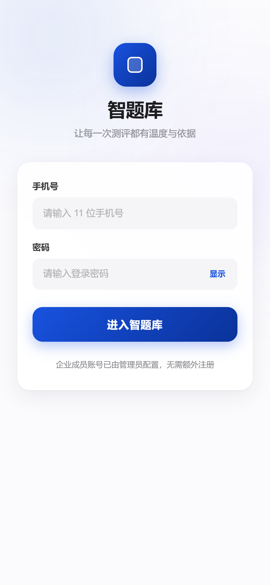
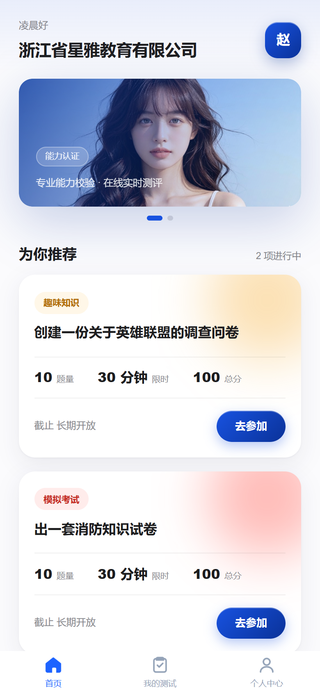
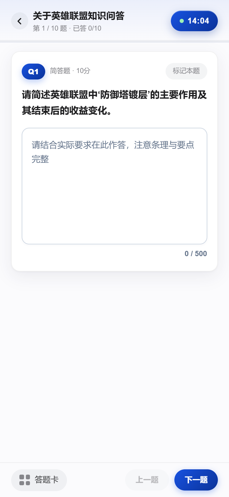
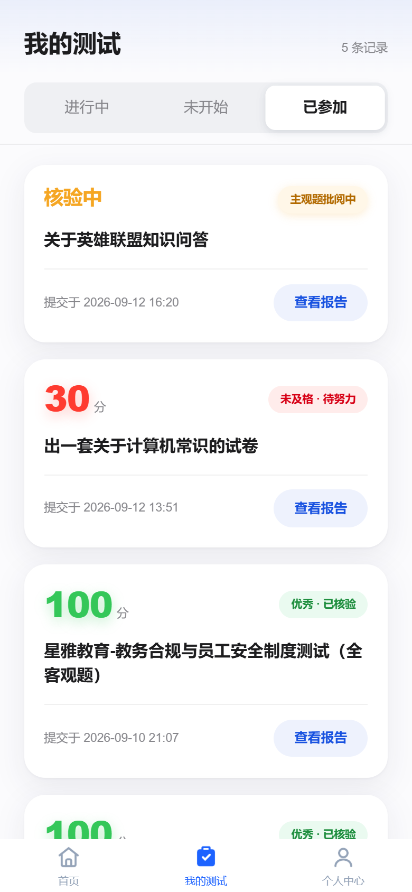
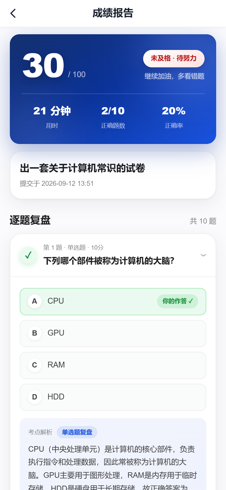
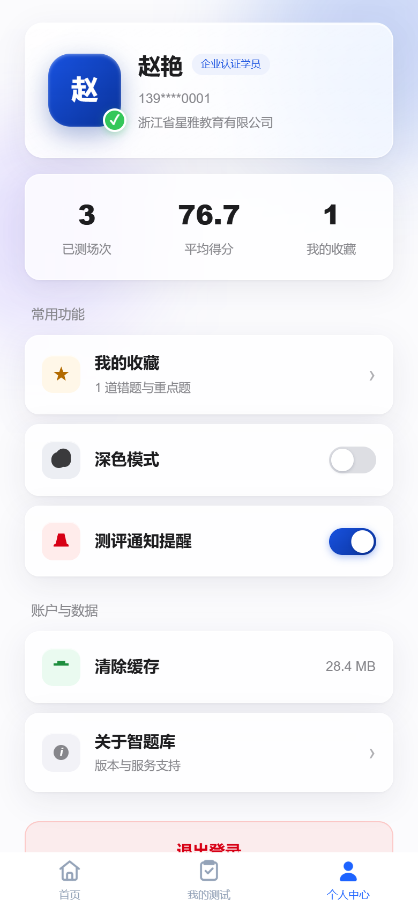
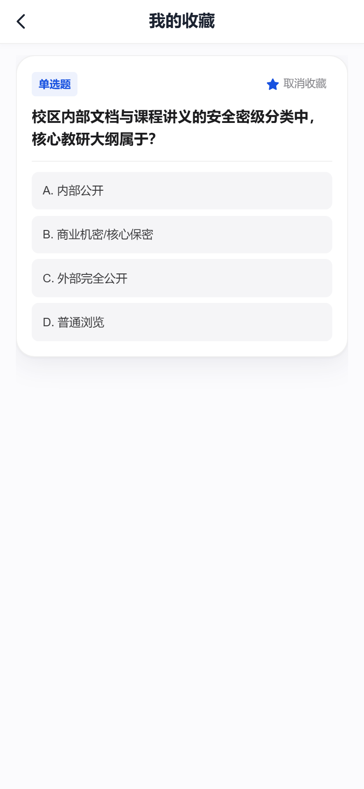

# 智题库 (TiKu) v1.5 C端考生端全景视觉与交互规范指南

> **设计基准**：Apple 钛金微光风（Apple Light-Titanium Glassmorphism）  
> **技术底座**：uni-app + Vue 3 + TypeScript + Vite + Pinia 持久化  
> **核心宗旨**：极致克制、沉浸触感、微光漫反射、全题型原生交互与严格考务防泄题安全。

---

## 🎨 视觉系统核心原则

1. **钛金冷白底盘**：全站以 `#fbfbfd` 冷钛白为基准底盘，摒弃刺眼惨白与沉闷灰暗，呈现极高通透感。
2. **微光漫反射呼吸感**：双色温弥散光晕（蓝、红、橙三态微光球），营造柔和细腻的 Apple 质感。
3. **物理级防泄题合规**：核验未公开期间（`pending_verification`），标准答案与考点解析在 DOM 层面物理阻断渲染，保障考试公平。
4. **原生组件零胶水封装**：考场题目与选项原生直接展开，杜绝外部抽象卡片带来的多层嵌套白屏和测量错位。

---

## 一、界面全景图文说明

### 1. 登录与身份绑定 (Login)
- **隐式无感知机构绑定**：考生输入 11 位手机号与密码后直接进入所属企业空间，免去复杂的多租户切换阻力。
- **暮光背景与微光浮雕**：双色渐变漫反射光斑配合半透明毛玻璃面板，彰显尊贵身份感。

---

### 2. 首页 · 任务大厅 (Home)
- **考生专属问候栏**：展示所属机构徽标与考生姓氏字母圆角微标。
- **32rpx 大圆角动态 Banner**：轮播重点考试宣发，配备 Apple 药丸型高亮指示胶囊。
- **节奏律动微光测评卡片**：根据试卷类型与限时交替渲染红、蓝、橙三色漫反射弥散微光背景；提供题量、限时、总分三维数据矩阵。

---

### 3. 在线考场 · 沉浸答题 (Exam)
- **Apple 极简顶栏**：集成动态进度细线、答题计数与微光倒计时药丸（剩余 5 分钟激活动态心跳呼吸红标）。
- **五大原生题型支持**：
  - 单选 / 多选：大圆角呼吸选项条，点击触发深空蓝微光高亮；
  - 判断题：醒目的双大胶囊按钮（对 · 正确 / 错 · 错误）；
  - 填空题与简答题：高对比度 `#ffffff` 纯白背景、`#cbd5e1` 实体清晰冷灰边框、`#0f172a` 深色易读字体与深空蓝聚焦光晕。
- **60vh 磨砂玻璃答题卡抽屉**：自适应 5 列题号矩阵，支持当前题、已作答、已标记快速跳转定位。
- **防作弊屏幕切换检测**：累计切屏告警与强制收卷。

---

### 4. 我的测评 · 进度追踪 (Records)
- **三段式果冻吸顶滑块**：进行中 / 待开始 / 已完成，支持平滑弹性过渡切换。
- **状态感知指示**：
  - 进行中：闪烁鲜活脉冲绿点，一键「继续作答」；
  - 待开始：优雅锁形图标与开启时间倒计时；
  - 已完成：大字号出分与得分色阶（优秀绿 / 预警黄 / 待努力红）。

---

### 5. 成绩分析报告 · 逐题复盘 (Report)
- **内置标准白色微质感 Navbar**：自然融入冷白底盘，摒弃突兀蓝底。
- **深空蓝出分夜空看板**：出分态渲染 110rpx 超大分数与击败率徽章；核验态自动展现 Apple 琉璃防泄题盾牌插画。
- **手风琴折叠复盘卡片**：绿色对勾与红色叉叉呼吸气泡，展开呈现「你的作答 ✓/✕」与标准答案对比，并内嵌淡蓝渐变考点解析卡片与一键错题收藏。

---

### 6. 个人中心与重点收藏 (Profile & Favorites)
- **Apple 钛金玻璃个人名片**：展示实名认证徽章、所属机构名与已测场次、平均得分、我的收藏三大核心计数。
- **微交互功能列表**：提供缓存一键清理、测评通知提醒与系统关于弹窗。
- **错题与重点收藏中心**：聚合考生在复盘过程中沉淀的题库资产，支持随时温故知新。

| 个人中心 | 我的错题重点收藏 |
| :---: | :---: |
|  |  |

---

## 二、工程规范与代码演进

1. **统一设计令牌**：全站样式均基于 `src/styles/tokens-apple.scss` 派生，严格统一 `$bg`、`$ink`、`$accent`、`$radius-card` 与 `$glass-blur`。
2. **严格变更规范**：每一个修改文件均在最顶部追加标准时间戳与变更日志，组件同级均维护对应 `.md` 设计文档。
3. **真实生产对接**：全流程打通 FastAPI 鉴权、考务获取、在线提交与成绩审核接口，实现生产级闭环。
